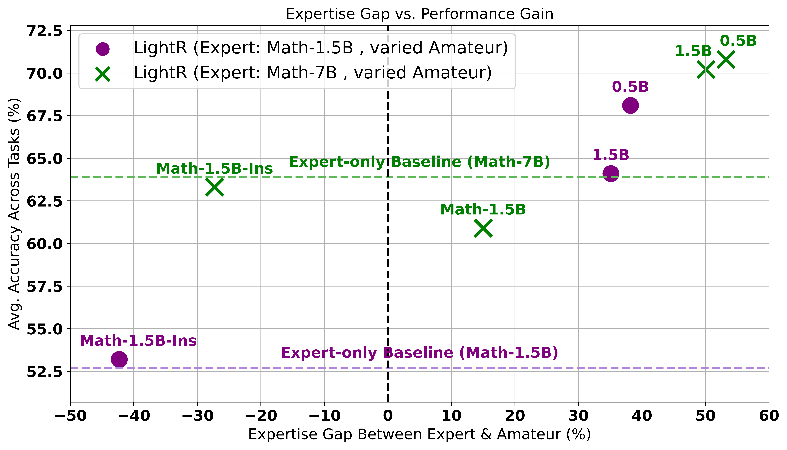

<!-- Icon and title -->
<h1 align="center">

<br>
💡 LightReasoner: 小模型能否教会大模型推理？
</h1>

<!-- Authors -->
<h3 align="center">
<a href="https://scholar.google.com/citations?user=BGT3Gb8AAAAJ&hl=en" target="_blank"> 王靖源</a> ·
<a href="https://scholar.google.com/citations?user=k6yAt6IAAAAJ&hl=en&oi=sra" target="_blank"> 陈言楷</a> ·
<a href="https://scholar.google.com/citations?user=__9uvQkAAAAJ&hl=en" target="_blank"> 李中行</a> ·
<a href="https://scholar.google.com/citations?user=Zkv9FqwAAAAJ&hl=en" target="_blank"> 黄超</a>
</h3>

<p align="center">
  
</p>

<!-- Quick links -->
<div align="center">

[](https://arxiv.org/abs/2510.07962)
[](https://huggingface.co/papers/2510.07962)
[](https://opensource.org/licenses/MIT)
[](https://github.com/QwenLM/Qwen2.5-Math)

[](https://huggingface.co/collections/bearthecoder/lightreasoner-models-68edbf175755ca5a8c699f9c)


<br>

<a href="./Communication.md"></a>
<a href="./Communication.md"></a>

</div>

---

<p align="center">
  
  <br>
  <em><strong>图 1: LightReasoner 以卓越的 Token 效率实现更优性能</strong> - 在零样本 pass@1 准确率上实现持续提升，同时相较于传统 SFT，总时间计算开销减少 90%，采样问题数减少 80%，调优 Token 数减少 99%。</em>
</p>

**💡 核心洞察：**

这一效率突破表明，**策略性的 Token 选择**，而非穷举式的训练，才是解锁大语言模型推理潜力的最有效途径 —— 证明了*更智能，而非更蛮干*，才是实现可扩展 AI 提升的道路。

---

## 🎉 最新动态
- [x] [2025/10/14] 🚀 新发布：[`LRsamples`](./LRsamples) — **预收集的 LightReasoner 训练样本**，可立即用于微调。此数据集支持直接模型训练，无需运行完整的采样流程，简化了复现工作并加速了下游研究流程。
- [x] [2025/10/14] 🚀 新发布：**LightReasoner 增强模型** 现已在 🤗 [Hugging Face Hub](https://huggingface.co/collections/bearthecoder/lightreasoner-models-68edbf175755ca5a8c699f9c) 上提供。这些即用型模型采用我们高效的推理增强方法进行了微调，可供立即部署和实验。
- [x] [2025/10/12] 🚀 新发布：基于 Qwen2.5-Math 和 DeepSeek 模型实验的核心实现。

---

## ⚡ 内容提要

**✨ LightReasoner ✨** 颠覆了 AI 训练的常规认知 —— 小语言模型 (SLM) 不仅仅向大模型 (LLM) *学习*；它们实际上可以更好、更快地*教导* LLM！

**🔥 面临的挑战：**

监督微调 (SFT) 面临三个核心瓶颈：

- **📊 数据密集型：** 依赖人工标注或拒绝采样的数据集。

- **⚖️ 均匀学习：** 平等地训练所有 Token，尽管只有一小部分真正重要。

- **🔗 依赖真实标签：** 阻碍了在新领域和推理格式上的适应性。

**🔍 核心洞察：**

我们将 90% 的计算资源分配给了模型已经掌握的知识，而对于真正推动突破的关键 10%，却*投入不足*。

## 📈 LightReasoner：*更好、更快*

**在 7 个基准测试 × 5 个模型上进行验证**

🚀 **性能提升**

LightReasoner 在多个数据集上持续提升推理准确率：

- 📈 **Qwen2.5-Math-1.5B:** GSM8K 上 +28.1%, MATH 上 +25.1%, SVAMP 上 +7.2%, ASDIV 上 +11.7%

- 📈 **DeepSeek-R1-Distill-Qwen-1.5B:** GSM8K 上 +4.3%, MATH 上 +6.0%, OlympiadBench 上 +17.4%

- 📈 **Qwen2.5-Math-7B:** GSM8K 上 +10.4%, MATH 上 +6.0%, SVAMP 上 +9.3%, ASDIV 上 +7.9%

- 🌍 **强大的泛化能力：** 仅在 GSM8K 上训练，却在 **7 个基准测试** 上均有提升

⚡ **效率突破**

以 `Qwen2.5-Math-1.5B` 为例，LightReasoner 相较于 SFT 实现了显著的效率提升：

- ⏱️ **总时间减少 90%:** 4 小时 → 0.5 小时

- 🧾 **采样问题减少 80%:** 3,952 → 1,000 个问题

- 🔢 **调优 Token 减少 99%:** 1.77M → 20K 个 Token

🌟 **核心特性**

- 🎯 **SLM–LLM 教学：**

  反直觉地使用较小的*"业余"*模型来识别**关键推理时刻**，让更强的*"专家"*模型在这些时刻集中学习。

- ⚡ **极致的 Token 效率：**

  通过选择性地优化**高影响力的推理步骤**，而非在全轨迹上均匀训练，实现了比 SFT **少 99% 的调优 Token**。

- 🔄 **三阶段轻量级框架：**

  (1) 通过专家-业余 KLD 检测进行**关键步骤选择**

  (2) 通过捕捉专家-业余行为差异进行**对比监督**

  (3) 通过**自蒸馏**内化专家优势

- 📈 **KL 引导学习：**

  利用专家和业余预测之间的**行为差异**来**精确定位推理瓶颈**——*所有这些都无需真实标签。*

- 🧠 **专长胜于规模：**

  证明了**领域专长差距**，而非模型大小，是驱动有效对比的关键 —— 即使是相同大小但知识不同的模型也能产生**强大的教学信号**。

---

## 🧩 LightReasoner 框架

<p align="center">
  
  <br>
  <em>
    <strong>图 2: LightReasoner 框架概览。</strong> (1) 采样阶段：专家和业余模型生成分布 π<sub>E</sub> 和 π<sub>A</sub>。信息性步骤选择保留 D<sub>KL</sub>(π<sub>E</sub> ∥ π<sub>A</sub>) > β 的步骤，对比监督通过专家-业余对比构建软标签 v<sub>C</sub> 以捕捉专家的优势。(2) 微调阶段：通过最小化专家模型输出与 v<sub>C</sub> 之间的 KL 散度来增强专家模型。
  </em>
</p>

---

## 🚀 快速开始

*LightReasoner* 使用起来*极其简单*。我们将其设计得非常易于上手 —— 任何人都可以尝试并亲身体验其"反直觉的有效性"。
别担心 —— 只需按照下面几个 🪄 简单的步骤，您就可以设置并运行您选择的模型！

### 📦 准备工作
```bash
git clone https://github.com/HKUDS/LightReasoner.git
cd LightReasoner
```

1️⃣ 安装所有依赖:

```bash
pip install -r requirements.txt
```

2️⃣ 下载您选择的专家和业余模型。例如:

🦉 专家模型
```bash
huggingface-cli download Qwen/Qwen2.5-Math-1.5B --local-dir ./Qwen2.5-Math-1.5B
```

🐣 业余模型
```bash
huggingface-cli download Qwen/Qwen2.5-0.5B --local-dir ./Qwen2.5-0.5B
```


3️⃣ 准备训练数据：

```bash
python data_prep.py
```


#### ⚠️ 注意事项

LightReasoner 依赖专家-业余模型配对来生成监督信号。因此，这对模型的选择对于方法的成功至关重要。

⚖️ **经验法则**: 

专家模型应**显著优于**业余模型，而业余模型必须保持**足够的能力**以产生连贯的推理。在实践中，性能在平衡的 *“最佳点”* 达到峰值，而不是简单地扩大能力差距。

在我们的实验中，专家模型包括 *Qwen2.5-Math-1.5B*、7B、它们的 Instruct 版本以及 *DeepSeek-R1-Distill* 变体。业余模型固定为 *Qwen2.5-0.5B*，它在提供强烈对比的同时，保持了足够的推理能力以产生有意义的信号。

我们 *鼓励* 您探索其他模型系列（例如 *Llama*），但在设置您的专家-业余协作时，请牢记此**平衡原则**。


#### 📋 说明

- 我们 *默认* 使用 GSM8K，因为它侧重于步骤清晰、广泛适用的逻辑推理，而非特定领域的符号。这确保了业余模型即使缺乏数学专项训练，仍能产生适合对比监督的可解释输出。

您 *完全可以* 尝试其他数据集 —— LightReasoner 完全适配。但是，根据您的数据集，您可能需要调整超参数和业余模型的选择，以确保训练稳定和对比有意义。


---


### 🎯 采样

此步骤构建用于下游微调的 **LightReasoner 监督数据集**。保留具有高专家-业余 KLD 的步骤。这些选定的步骤被转换为监督样本，通过分布对比来编码专家的优势。有关完整细节，请参阅 [我们的论文](https://arxiv.org/abs/2510.07962).


```bash
python LightR_sampling.py --max_questions 1000
```


#### 📋 说明
在运行脚本之前，您应该：

使用您自己的相关路径更新 **配置部分**。

调整最大问题数以控制监督数据集的大小，调整采样参数以探索更优组合，并根据可用的计算资源调整批次大小。


#### ⚡ **捷径**


为了省去运行采样流程的麻烦 —— 尽管使用 LightReasoner 已经 *更轻量、更容易*，但对于计算资源不充足的用户来说可能仍然令人生畏 —— 我们现在提供 *即用型的* LightReasoner 样本，**让您直接跳到微调阶段！** 🚀  


 

您可以在 [`LRsamples`](./LRsamples) 目录下的 zip 文件中找到以下预收集的 LightReasoner 采样数据集：

- **`LR_Qwen7_gsm8k`** — 适用于 **Qwen2.5-Math-7B**

- **`LR_ds1.5_gsm8k`** — 适用于 **DeepSeek-R1-Distill-Qwen-1.5B**

- **`LR_Qwen1.5_gsm8k`** — 适用于 **Qwen2.5-Math-1.5B** 

- We provide **two versions**, one sampled with **Torch 3.1** and another with **Torch 3.8**, as we found that the sampling results (i.e., the model’s generated outputs) can slightly vary across Torch versions.  

- The performance fluctuation is minimal — typically within **2–3%**, with later Torch versions usually performing slightly better.

These datasets make it **much easier to reproduce** our results directly — no additional sampling required! ✨


您可以在 LRsamples 目录下的 zip 文件中找到以下预收集的 LightReasoner 采样数据集：

LR_Qwen7_gsm8k — 适用于 Qwen2.5-Math-7B

LR_ds1.5_gsm8k — 适用于 DeepSeek-R1-Distill-Qwen-1.5B

LR_Qwen1.5_gsm8k — 适用于 Qwen2.5-Math-1.5B

我们提供了两个版本，一个使用 Torch 3.1 采样，另一个使用 Torch 3.8 采样，因为我们发现采样结果（即模型生成的输出）在不同 Torch 版本间可能略有不同。

性能波动很小 —— 通常在 2–3% 以内，较新的 Torch 版本通常表现稍好。

这些数据集使得直接复现我们的结果容易得多—— 无需额外采样！✨


---


### ⚙️ Fine-tuning

This step launches the full LightReasoner fine-tuning pipeline — combining *dataset loading*, *LoRA configuration*, and *contrastive KLD training* into a unified workflow.


#### 💻 Run Options

**Foreground (simple run):**
```bash
python LightR_finetuning.py
```

**Background (recommended for long training):**
```bash
nohup python LightR_finetuning.py > finetune.log 2>&1 &
```

**Monitor progress:**
```bash
tail -f finetune.log
```


#### ⚠️ Caveat

*The expert model used for fine-tuning must be identical to the one used during sampling — this alignment is essential for correct behavior.*


#### 📋 Note

Before running the script, edit the **config section** to match your setup:

- 🔹 Replace `<path_to_expert_model>` with your base model path *(e.g., `"./Qwen2.5-Math-7B"` or a local folder).*  

- 🔹 Replace `<path_to_training_dataset>` with your dataset JSONL file.  

- 🔹 Replace `<output_directory>` with the directory where checkpoints and the final model will be saved.  

- 🔹 Set `torch_dtype` according to your hardware *(e.g., `torch.bfloat16` for **H100**, `torch.float16` for **A100**).*


---


### 🔗 Model Merging

Use this step to **merge the full model** (base + LoRA) locally, so it behaves as a **standalone model** without any LoRA dependency.

```bash
python merge.py
```

#### 📋 Note
Before running the merge script, update the **config section** with your own paths: 

- 🔹 `base_model_path` to your base model directory *(e.g., `./Qwen2.5-Math-7B`)* 

- 🔹 `lora_ckpt_path` to your LoRA checkpoint directory *(e.g., `./ft_qw7_gsm8k/checkpoint-1000`)*  

- 🔹 `merged_model_path` to where you want the merged model to be saved *(e.g., `./ft-7B-merged`)*


---


### 📈 Evaluation

All evaluations are performed using the **official Qwen2.5-Math toolkit**.  

Please refer to the [`evaluation`](./evaluation) folder for detailed usage and setup instructions.


---


## 📊 Main Results

| Model                                         | GSM8K | MATH | SVAMP | ASDiv | Minerva Math | Olympiad Bench | MMLU STEM | AVG. |
|-----------------------------------------------|-------|------|-------|-------|-------------------|---------------|----------------|------|
| **<nobr>Qwen2.5-Math-1.5B</nobr>**            |       |      |       |       |                   |               |                |      |
| Baseline                                      | 42.5  | 34.2 | 68.8  | 68.1  | 9.9               | 23.7          | 49.8           | 42.4 |
| + SFT                                         | 69.2  | 57.1 | 64.1  | 70.2  | **15.1**          | **27.6**      | 47.7           | 50.1 |
| + LightR                                      | **70.6** | **59.3** | **76.0** | **79.8** | 11.4 | 27.1 | **54.9** | **54.2** |
| **<nobr>Qwen2.5-Math-1.5B-Instruct</nobr>**   |       |      |       |       |                   |               |                |      |
| Baseline                                      | 84.8  | 75.8 | 94.2  | 94.7  | 29.4              | 37.5          | 57.4           | 67.7 |
| + SFT                                         | 85.4  | 75.8 | 93.5  | 94.7  | 31.6              | 37.5          | 56.2           | 67.8 |
| + LightR                                      | **86.7** | 75.5 | 93.0 | 94.1 | **32.0** | **37.8** | 55.2 | **67.8** |
| **<nobr>DeepSeek-R1-Distill-Qwen-1.5B</nobr>**|       |      |       |       |                   |               |                |      |
| Baseline                                      | 75.2  | 54.2 | 79.9  | 84.9  | 16.2              | 19.1          | 22.3           | 50.3 |
| + SFT                                         | 78.2  | **60.3** | 81.5 | 87.4 | **18.4** | 21.2 | 26.2 | 53.3 |
| + LightR                                      | **79.5** | 60.2 | **83.5** | **87.5** | 18.0 | **36.5** | **26.2** | **55.9** |
| **<nobr>Qwen2.5-Math-7B</nobr>**              |       |      |       |       |                   |               |                |      |
| Baseline                                      | 57.5  | 51.8 | 67.9  | 72.7  | 14.0              | 16.0          | 69.8           | 50.0 |
| + SFT                                         | 64.4  | **63.3** | 76.2 | 76.6 | 12.1 | **20.5** | 68.5 | 54.5 |
| + LightR                                      | **67.9** | 57.8 | **77.2** | **80.6** | 12.1 | 16.9 | **70.5** | **54.7** |
| **<nobr>Qwen2.5-Math-7B-Instruct</nobr>**     |       |      |       |       |                   |               |                |      |
| Baseline                                      | 95.2  | 83.2 | 93.9  | 95.3  | 33.8              | 41.5          | 69.3           | 73.2 |
| + SFT                                         | 95.4  | 83.1 | **94.1** | 95.2 | **38.2** | 40.7 | 68.2 | **73.6** |
| + LightR                                      | **95.8** | **83.6** | 93.1 | 95.2 | 34.2 | 39.0 | 67.8 | 72.7 |


- Trained *solely* on GSM8K, LightReasoner generalizes effectively for 5 baseline models, achieving consistent gains across 7 benchmarks.

- **+28.1%** on GSM8K, **+25.1%** on MATH, **+7.2%** on SVAMP, **+11.7%** on ASDIV for Qwen2.5-Math-1.5B.  

- **+4.3%** on GSM8K, **+6.0%** on MATH, **+17.4%** on OlympiadBench for DeepSeek-R1-Distill-Qwen-1.5B. 

- **+10.4%** on GSM8K, **+6.0%** on MATH, **+9.3%** on SVAMP, **+7.9%** on ASDIV for Qwen2.5-Math-7B.  

- Efficiency vs. SFT: **90% less total time**, **80% fewer sampled problems**, **99% fewer tuned tokens**.  


---


## ⏱️ Efficiency Study

| **Method** | **Total Time** | **Sampled Problems** | **Tuned Tokens** | **Average Gain** |
|------------|----------|------------|------------|----------|
| **Qwen2.5-Math-1.5B** |||||
| + SFT      | 4.0h     | 3952       | 1.77M      | +7.7%   |
| **+ LightReasoner** | **0.5h** | **1000**  | **0.02M**  | **+11.8%** |
| **Qwen2.5-Math-7B** |||||
| + SFT      | 9.5h     | 6029       | 2.20M      | +4.5%   |
| **+ LightReasoner** | **0.75h** | **1000** | **0.02M**  | **+4.7%** |
| **DeepSeek-R1-Distill-Qwen-1.5B** |||||
| + SFT     | 3.6h     | 6023       | 5.95M      | +3.0%   |
| **+ LightReasoner** | **0.5h** | **1000**  | **0.02M**  | **+5.6%** |
| **Qwen2.5-Math-1.5B-Instruct** |||||
| + SFT     | 3.4h     | 7153       | 2.08M      | +0.1%   |
| **+ LightReasoner** | **0.4h** | **1000**  | **0.02M**  | +0.1%   |


- 🧑‍🏫 **Supervised Fine-Tuning (SFT):**  
  - Implemented with rejection sampling, where models are fine-tuned on demonstrations of correct reasoning trajectories.  
  
  - For a fair comparison, SFT adopts the *same* experimental configuration as LightReasoner, performing LoRA-based fine-tuning *exclusively* on the GSM8K training set.


- 📈 **Efficiency Evaluation:**  
  - ⏱️ **Time Budget** — Sampling time plus fine-tuning time, measured on a single *NVIDIA H200 GPU* without inference accelerators (e.g., vLLM).  
  
  - 📘 **Training Instances** — Number of distinct GSM8K training set problems used to generate the supervision dataset.  
  
  - 🔢 **Tuned Tokens** — Computational overhead at the token level: *LightReasoner* trains on selective next-token predictions, whereas *SFT* optimizes over full reasoning trajectories.


<p align="center">
  
  
  
  
  <br>
  <em><strong>Figure 3: LightReasoner matches or surpasses SFT performance with remarkable resource efficiency</strong> — achieving competitive accuracy while cutting training time by 90%, reducing sampled problems by 80%, and requiring 99% fewer tuned tokens.</em>

</p>


💡 **Key Insight:** 

*This marks a fundamental shift in how models are trained — **targeting critical reasoning steps** outperforms brute-force learning, making high-quality AI training achievable even with limited computational resources.*


---


## 🧠 Expertise-Driven Contrast

| **Amateur Model** | **Perf. Gap** | **GSM8K** | **MATH** | **SVAMP** | **ASDiv** | **MMLU STEM** | **AVG.** |
|-------------------|-------------|-----------|----------|-----------|-----------|---------------|----------|
| **Expert: <nobr>Qwen2.5-Math-1.5B</nobr>** |||||||||
| **<nobr>Qwen2.5-0.5B</nobr>**             | **38.2**  | **70.6** | **59.3** | **76.0** | **79.8** | **54.9** | **68.1** |
| <nobr>Qwen2.5-1.5B</nobr>                 | 35.1  | 63.4 | 57.1 | 69.7 | 75.7 | 54.8 | 64.1 |
| <nobr>Qwen2.5-Math-1.5B</nobr>            | /  | / | / | / | / | / | / |
| <nobr>Qwen2.5-Math-1.5B-Ins</nobr>        | -42.3 | 41.4 | 35.5 | 67.5 | 66.4 | 55.0 | 53.2 |
| *Expert Only (Baseline)*                  | /     | 42.5 | 34.2 | 68.8 | 68.1 | 49.8 | 52.7 |
| **Expert: <nobr>Qwen2.5-Math-7B</nobr>** |||||||||
| **<nobr>Qwen2.5-0.5B</nobr>**             | **53.2**  | **67.9** | **57.8** | **77.2** | **80.6** | **70.5** | **70.8** |
| <nobr>Qwen2.5-1.5B</nobr>                 | 50.1  | 69.0 | 56.0 | 77.6 | 78.9 | 69.5 | 70.2 |
| <nobr>Qwen2.5-Math-1.5B</nobr>            | 15.0  | 56.9 | 50.2 | 63.5 | 63.4 | 70.7 | 60.9 |
| <nobr>Qwen2.5-Math-1.5B-Ins</nobr>        | -27.3 | 59.4 | 49.0 | 68.3 | 69.6 | 70.3 | 63.3 |
| *Expert Only (Baseline)*                  | /     | 57.5 | 51.8 | 67.9 | 72.7 | 69.8 | 63.9 |


- **Domain Expertise over Scale:** *The success of Expert–Amateur collaboration is driven most effectively by domain-specific knowledge rather than model size (e.g., Qwen2.5-Math-1.5B vs. Qwen2.5-1.5B), freeing LightReasoner from rigid scaling constraints.*

- **Dependence on Expertise Gap:** *Performance gains are closely correlated with the size of the expertise gap — as the Amateur approaches the Expert’s capability, contrastive signals weaken and improvements diminish.*


---

## 🔍 More Insights

<p align="center">
  
  
</p>

<p align="center">
  
  <em>👈 Figure 4(a): Expert–Amateur Pairing Effects — Each point represents a fixed Expert model paired with an Amateur model. The performance gains achieved by LightReasoner diminish as the expertise gap narrows.</em><br>

  <em>👉 Figure 4(b): Impact of Ablation — Removing key components from LightReasoner consistently reduces performance, revealing their critical contributions.</em>

</p>


---


## 🏆 Comparison with Competing Methods

<table>
<tr>
<td>

<!-- Left Table -->
  
| **Attribute**        | **Time** | **SFT** | **LightR** |
|-----------------------|----------------|---------|------------|
| Full trajectories     | ⬆️          | ✅      | ❌         |
| All-token tuning      | ⬆️          | ✅      | ❌         |
| Prefix termination    | ⬇️          | ❌      | ✅         |
| Selective tokens      | ⬇️          | ❌      | ✅         |
| Verification-free     | ⬇️          | ❌      | ✅         |

</td>
<td>

<!-- Right Table -->

| **Attribute**         | **Utility** | **CD**      | **LightR** |
|------------------------|------------------|-------------|------------|
| Contrast usage         | /                | Inference   | Training   |
| Size-based contrast    | ⬇️            | ✅          | ❌         |
| Expertise contrast     | ⬆️            | ❌          | ✅         |
| Persistent benefits    | ⬆️            | ❌          | ✅         |
| Standalone inference  | ⬆️            | ❌          | ✅         |

</td>
</tr>
</table>

- 👈 *Left:* Efficiency contrasts at a glance. ⬆️ and ⬇️ indicate whether each aspect helps or hurts the overall efficiency of the method. 
  
- 👉 *Right:* Key differences between traditional Contrastive Decoding (CD) methods and LightReasoner. ⬆️ and ⬇️ indicate whether each aspect helps or hurts the practicality of the method.


---


## ☕️ Citation

If you find this work useful, please consider citing our paper:

```python
@article{wang2025lightreasoner,
  title={LightReasoner: Can Small Language Models Teach Large Language Models Reasoning?},
  author={Wang, Jingyuan and Chen, Yankai and Li, Zhonghang and Huang, Chao},
  journal={arXiv preprint arXiv:2510.07962},
  year={2025}
}
```

Thank you for your interest in our work!


---


## 📜 License

This project is released under the [MIT License](./LICENSE).

