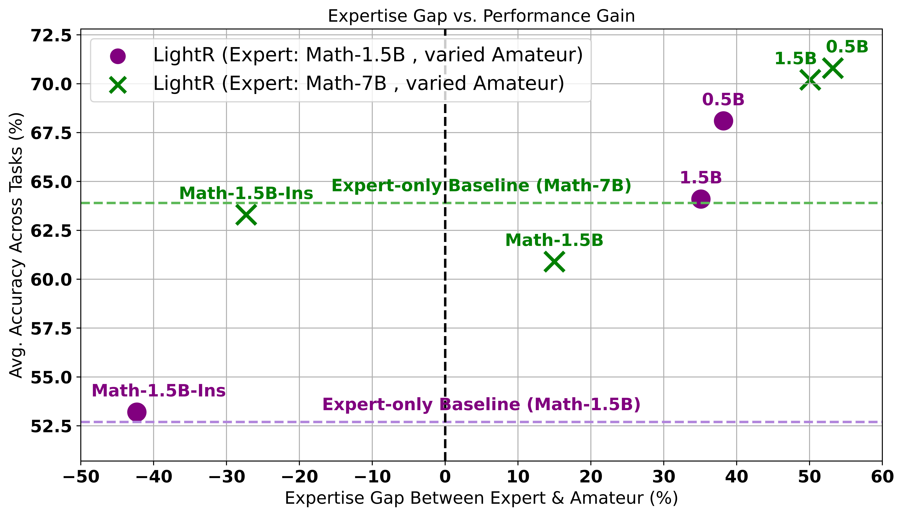
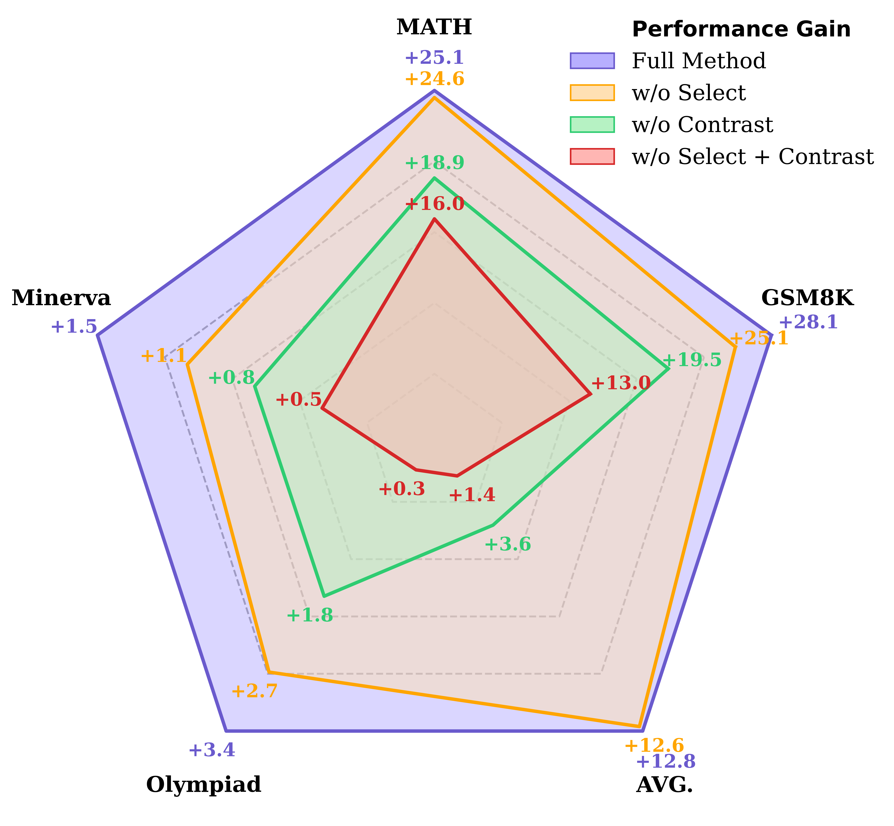

<!-- Icon and title -->
<h1 align="center">

<br>
💡 LightReasoner:  
Can <strong><em>SMALL</em></strong> Language Models Teach <strong><em>LARGE</em></strong> Language Models Reasoning?
</h1>


<!-- Authors -->
<h3 align="center">
<a href="https://scholar.google.com/citations?user=BGT3Gb8AAAAJ&hl=en" target="_blank">Jingyuan Wang</a> ·
<a href="https://scholar.google.com/citations?user=k6yAt6IAAAAJ&hl=en&oi=sra" target="_blank">Yankai Chen</a> ·
<a href="https://scholar.google.com/citations?user=__9uvQkAAAAJ&hl=en" target="_blank">Zhonghang Li</a> ·
<a href="https://scholar.google.com/citations?user=Zkv9FqwAAAAJ&hl=en" target="_blank">Chao Huang</a>
</h3>


<p align="center">
  
</p>


<!-- Quick links -->
<div align="center">

[](https://arxiv.org/abs/2510.07962)
[](https://opensource.org/licenses/MIT)
[](https://github.com/QwenLM/Qwen2.5-Math)

[](https://huggingface.co/collections/bearthecoder/lightreasoner-models-68edbf175755ca5a8c699f9c)


<!-- [](https://huggingface.co/) -->
<!-- -->

</div>


<p align="center">
  
  <br>
  <em>Figure 1: LightReasoner consistently improves zero-shot pass@1 accuracy while requiring
  90% less time, 80% fewer sampled problems, and 99% fewer tuned tokens compared to SFT under same settings.</em>
</p>


## 🎉 News
- [x] [2025/10/14] Uploaded [`lr_samples`](./lr_samples) — pre-collected **LightReasoner training samples** for direct fine-tuning. Users can now fine-tune the corresponding models without re-running the sampling pipeline, bringing greater convenience for reproduction and downstream research.
- [x] [2025/10/14] Released **LightReasoner Enhanced Models** on 🤗 [Hugging Face Hub](https://huggingface.co/collections/bearthecoder/lightreasoner-models-68edbf175755ca5a8c699f9c).
- [x] [2025/10/12] Released initial implementation and experiments on Qwen2.5-Math and DeepSeek baselines. 


## ⚡ TL;DR
**LightReasoner** is a lightweight and resource-efficient learning framework that turns weaker language models into effective teaching signals for reinforcing stronger models.


## 📝 Abstract
Large language models (LLMs) have demonstrated remarkable progress in reasoning, often through supervised fine-tuning (SFT). However, SFT is resource-intensive, relying on large curated datasets, rejection-sampled demonstrations, and uniform optimization across all tokens—even though only a fraction carry meaningful learning value. In this work, we explore a counterintuitive idea: can smaller language models teach larger language models by revealing high-value reasoning moments that reflect the latter's unique strength? We propose *LightReasoner*, a novel framework that leverages the behavioral divergence between a stronger *expert* model and a weaker *amateur* model. LightReasoner operates in two stages: (1) a *sampling stage* that pinpoints critical reasoning moments and constructs supervision examples capturing the expert's advantage through expert–amateur contrast, and (2) a *fine-tuning stage* that aligns the expert model with these distilled examples, amplifying its reasoning strengths. Across 7 mathematical benchmarks, LightReasoner improves accuracy by up to 28.1%, while reducing time consumption by 90%, sampled problems by 80%, and tuned token usage by 99%, all without relying on ground-truth labels. By turning weaker SLMs into effective teaching signals, LightReasoner offers a scalable and resource-efficient approach for advancing LLM reasoning.


## 🧩 LightReasoner Framework

<p align="center">
  
  <br>
  <em>
    <strong>Figure 2: Overview of the LightReasoner framework.</strong> (1) Sampling Stage: Expert and Amateur models generate distributions π<sub>E</sub> and π<sub>A</sub>. Informative step selection retains steps with D<sub>KL</sub>(π<sub>E</sub> ∥ π<sub>A</sub>) > β, and contrastive supervision constructs soft labels v<sub>C</sub> capturing the Expert's advantage through Expert–Amateur contrast. (2) Fine-tuning Stage: The Expert model is enhanced by minimizing the KL divergence between its output and v<sub>C</sub>.
  </em>
</p>


## 🚀 Quick Start

*LightReasoner* is incredibly *easy* to use. We’ve designed it to be accessible — so anyone can try it out and experience its “counterintuitive effectiveness” firsthand.
No sweat — you’ll have it set up and running with your model of choice in just a few 🪄 simple steps below!


### 📦 Get Ready
```bash
git clone https://github.com/HKUDS/LightReasoner.git
cd LightReasoner
```

1️⃣ Install all dependencies:

```bash
pip install -r requirements.txt
```

2️⃣ Download the Expert and Amateur models of your choice. For example:

🦉 Expert Model
```bash
huggingface-cli download Qwen/Qwen2.5-Math-1.5B --local-dir ./Qwen2.5-Math-1.5B
```

🐣 Amateur Model
```bash
huggingface-cli download Qwen/Qwen2.5-0.5B --local-dir ./Qwen2.5-0.5B
```


3️⃣ Prepare the training data:

```bash
python data_prep.py
```


#### ⚠️ Caveat

LightReasoner relies on **Expert–Amateur model pairing** to generate supervision signals. Thus, the choice of this pair is crucial to the method’s success.  

⚖️ **Rule of Thumb**: 

The Expert should **significantly outperform** the Amateur, while the Amateur must remain **competent enough** to produce coherent reasoning. In practice, performance peaks at a balanced *“sweet spot”* rather than simply widening the capability gap.   

In our experiments, the Experts include *Qwen2.5-Math-1.5B*, *7B*, their *Instruct* counterparts, and *DeepSeek-R1-Distill* variants. The Amateur is fixed as *Qwen2.5-0.5B*, which offers strong contrast while maintaining sufficient reasoning ability to yield meaningful signals.  

You’re *encouraged* to explore other model families (e.g., *Llama*), but keep this **balance principle** in mind when setting up your Expert–Amateur collaboration.


#### 📋 Note

- We use GSM8K *by default* for its emphasis on step-by-step, broadly applicable logical reasoning rather than domain-specific notation. This ensures that the Amateur, despite lacking math-specific training, can still produce interpretable outputs suitable for contrastive supervision.

- You’re *absolutely* free to try other datasets — LightReasoner is fully adaptable. However, depending on your dataset, you may need to adjust hyperparameters and the choice of Amateur model to ensure stable training and meaningful contrasts.


### 🎯 Sampling

This step builds the **LightReasoner supervision dataset** for downstream fine-tuning. Steps with high Expert-Amateur KLD are retained. These selected steps are transformed into supervision examples that encode the Expert’s strengths through *distributional contrast*. For full details, please see [our paper](https://arxiv.org/abs/2510.07962).


```bash
python LightR_sampling.py --max_questions 1000
```

#### 📋 Note

Before running the script, you should:

- Update the **config section** with your own relative paths. 

- Adjust the maximum number of problems to control the size of your supervision dataset, tweak the sampling parameters to explore more optimal combinations, and tune the batch size based on your available compute resources.


### ⚙️ Fine-tuning

This step launches the full LightReasoner fine-tuning pipeline — combining *dataset loading*, *LoRA configuration*, and *contrastive KLD training* into a unified workflow.


#### 💻 Run Options

**Foreground (simple run):**
```bash
python LightR_finetuning.py
```

**Background (recommended for long training):**
```bash
nohup python LightR_finetuning.py > finetune.log 2>&1 &
```

**Monitor progress:**
```bash
tail -f finetune.log
```

#### 📋 Note

Before running the script, edit the **config section** to match your setup:

- 🔹 Replace `<path_to_expert_model>` with your base model path *(e.g., `"./Qwen2.5-Math-7B"` or a local folder).*  

- 🔹 Replace `<path_to_training_dataset>` with your dataset JSONL file.  

- 🔹 Replace `<output_directory>` with the directory where checkpoints and the final model will be saved.  

- 🔹 Set `torch_dtype` according to your hardware *(e.g., `torch.bfloat16` for **H100**, `torch.float16` for **A100**).*


### 🔗 Model Merging

Use this step to **merge the full model** (base + LoRA) locally, so it behaves as a **standalone model** without any LoRA dependency.

```bash
python merge.py
```

#### 📋 Note
Before running the merge script, update the **config section** with your own paths: 

- 🔹 `base_model_path` to your base model directory *(e.g., `./Qwen2.5-Math-7B`)* 

- 🔹 `lora_ckpt_path` to your LoRA checkpoint directory *(e.g., `./ft_qw7_gsm8k/checkpoint-1000`)*  

- 🔹 `merged_model_path` to where you want the merged model to be saved *(e.g., `./ft-7B-merged`)*


### 📈 Evaluation

All evaluations are performed using the **official Qwen2.5-Math toolkit**.  

Please refer to the [`evaluation`](./evaluation) folder for detailed usage and setup instructions.


## 📊 Main Results

| Model                                         | GSM8K | MATH | SVAMP | ASDiv | Minerva Math | Olympiad Bench | MMLU STEM | AVG. |
|-----------------------------------------------|-------|------|-------|-------|-------------------|---------------|----------------|------|
| **<nobr>Qwen2.5-Math-1.5B</nobr>**            |       |      |       |       |                   |               |                |      |
| Baseline                                      | 42.5  | 34.2 | 68.8  | 68.1  | 9.9               | 23.7          | 49.8           | 42.4 |
| + SFT                                         | 69.2  | 57.1 | 64.1  | 70.2  | **15.1**          | **27.6**      | 47.7           | 50.1 |
| + LightR                                      | **70.6** | **59.3** | **76.0** | **79.8** | 11.4 | 27.1 | **54.9** | **54.2** |
| **<nobr>Qwen2.5-Math-1.5B-Instruct</nobr>**   |       |      |       |       |                   |               |                |      |
| Baseline                                      | 84.8  | 75.8 | 94.2  | 94.7  | 29.4              | 37.5          | 57.4           | 67.7 |
| + SFT                                         | 85.4  | 75.8 | 93.5  | 94.7  | 31.6              | 37.5          | 56.2           | 67.8 |
| + LightR                                      | **86.7** | 75.5 | 93.0 | 94.1 | **32.0** | **37.8** | 55.2 | **67.8** |
| **<nobr>DeepSeek-R1-Distill-Qwen-1.5B</nobr>**|       |      |       |       |                   |               |                |      |
| Baseline                                      | 75.2  | 54.2 | 79.9  | 84.9  | 16.2              | 19.1          | 22.3           | 50.3 |
| + SFT                                         | 78.2  | **60.3** | 81.5 | 87.4 | **18.4** | 21.2 | 26.2 | 53.3 |
| + LightR                                      | **79.5** | 60.2 | **83.5** | **87.5** | 18.0 | **36.5** | **26.2** | **55.9** |
| **<nobr>Qwen2.5-Math-7B</nobr>**              |       |      |       |       |                   |               |                |      |
| Baseline                                      | 57.5  | 51.8 | 67.9  | 72.7  | 14.0              | 16.0          | 69.8           | 50.0 |
| + SFT                                         | 64.4  | **63.3** | 76.2 | 76.6 | 12.1 | **20.5** | 68.5 | 54.5 |
| + LightR                                      | **67.9** | 57.8 | **77.2** | **80.6** | 12.1 | 16.9 | **70.5** | **54.7** |
| **<nobr>Qwen2.5-Math-7B-Instruct</nobr>**     |       |      |       |       |                   |               |                |      |
| Baseline                                      | 95.2  | 83.2 | 93.9  | 95.3  | 33.8              | 41.5          | 69.3           | 73.2 |
| + SFT                                         | 95.4  | 83.1 | **94.1** | 95.2 | **38.2** | 40.7 | 68.2 | **73.6** |
| + LightR                                      | **95.8** | **83.6** | 93.1 | 95.2 | 34.2 | 39.0 | 67.8 | 72.7 |


- Trained *solely* on GSM8K, LightReasoner generalizes effectively for 5 baseline models, achieving consistent gains across 7 benchmarks.

- **+28.1%** on GSM8K, **+25.1%** on MATH, **+7.2%** on SVAMP, **+11.7%** on ASDIV for Qwen2.5-Math-1.5B.  

- **+4.3%** on GSM8K, **+6.0%** on MATH, **+17.4%** on OlympiadBench for DeepSeek-R1-Distill-Qwen-1.5B. 

- **+10.4%** on GSM8K, **+6.0%** on MATH, **+9.3%** on SVAMP, **+7.9%** on ASDIV for Qwen2.5-Math-7B.  

- Efficiency vs. SFT: **90% less total time**, **80% fewer sampled problems**, **99% fewer tuned tokens**.  


## ⏱️ Efficiency Study

| **Method** | **Total Time** | **Sampled Problems** | **Tuned Tokens** | **Average Gain** |
|------------|----------|------------|------------|----------|
| **Qwen2.5-Math-1.5B** |||||
| + SFT      | 4.0h     | 3952       | 1.77M      | +7.7%   |
| **+ LightReasoner** | **0.5h** | **1000**  | **0.02M**  | **+11.8%** |
| **Qwen2.5-Math-7B** |||||
| + SFT      | 9.5h     | 6029       | 2.20M      | +4.5%   |
| **+ LightReasoner** | **0.75h** | **1000** | **0.02M**  | **+4.7%** |
| **DeepSeek-R1-Distill-Qwen-1.5B** |||||
| + SFT     | 3.6h     | 6023       | 5.95M      | +3.0%   |
| **+ LightReasoner** | **0.5h** | **1000**  | **0.02M**  | **+5.6%** |
| **Qwen2.5-Math-1.5B-Instruct** |||||
| + SFT     | 3.4h     | 7153       | 2.08M      | +0.1%   |
| **+ LightReasoner** | **0.4h** | **1000**  | **0.02M**  | +0.1%   |

<p align="center">
  
  
  
  
  <br>
  <em>Figure 3: LightReasoner achieves competitive or superior accuracy to SFT while requiring 90% less time, 80% fewer sampled problems, and 99% fewer tuned tokens.</em>
</p>


- 📈 **Efficiency Evaluation:**  
  - ⏱️ **Time Budget** — Sampling time plus fine-tuning time, measured on a single *NVIDIA H200 GPU* without inference accelerators (e.g., vLLM).  
  
  - 📘 **Training Instances** — Number of distinct GSM8K training set problems used to generate the supervision dataset.  
  
  - 🔢 **Tuned Tokens** — Computational overhead at the token level: *LightReasoner* trains on selective next-token predictions, whereas *SFT* optimizes over full reasoning trajectories.


- 🧑‍🏫 **Supervised Fine-Tuning (SFT):**  
  - Implemented with rejection sampling, where models are fine-tuned on demonstrations of correct reasoning trajectories.  
  
  - For a fair comparison, SFT adopts the *same* experimental configuration as LightReasoner, performing LoRA-based fine-tuning *exclusively* on the GSM8K training set.


## 🧠 Expertise-Driven Contrast

| **Amateur Model** | **Perf. Gap** | **GSM8K** | **MATH** | **SVAMP** | **ASDiv** | **MMLU STEM** | **AVG.** |
|-------------------|-------------|-----------|----------|-----------|-----------|---------------|----------|
| **Expert: <nobr>Qwen2.5-Math-1.5B</nobr>** |||||||||
| **<nobr>Qwen2.5-0.5B</nobr>**             | **38.2**  | **70.6** | **59.3** | **76.0** | **79.8** | **54.9** | **68.1** |
| <nobr>Qwen2.5-1.5B</nobr>                 | 35.1  | 63.4 | 57.1 | 69.7 | 75.7 | 54.8 | 64.1 |
| <nobr>Qwen2.5-Math-1.5B</nobr>            | /  | / | / | / | / | / | / |
| <nobr>Qwen2.5-Math-1.5B-Ins</nobr>        | -42.3 | 41.4 | 35.5 | 67.5 | 66.4 | 55.0 | 53.2 |
| *Expert Only (Baseline)*                  | /     | 42.5 | 34.2 | 68.8 | 68.1 | 49.8 | 52.7 |
| **Expert: <nobr>Qwen2.5-Math-7B</nobr>** |||||||||
| **<nobr>Qwen2.5-0.5B</nobr>**             | **53.2**  | **67.9** | **57.8** | **77.2** | **80.6** | **70.5** | **70.8** |
| <nobr>Qwen2.5-1.5B</nobr>                 | 50.1  | 69.0 | 56.0 | 77.6 | 78.9 | 69.5 | 70.2 |
| <nobr>Qwen2.5-Math-1.5B</nobr>            | 15.0  | 56.9 | 50.2 | 63.5 | 63.4 | 70.7 | 60.9 |
| <nobr>Qwen2.5-Math-1.5B-Ins</nobr>        | -27.3 | 59.4 | 49.0 | 68.3 | 69.6 | 70.3 | 63.3 |
| *Expert Only (Baseline)*                  | /     | 57.5 | 51.8 | 67.9 | 72.7 | 69.8 | 63.9 |


- **Domain Expertise over Scale:** The success of Expert–Amateur collaboration is driven most effectively by domain-specific knowledge rather than model size (e.g., Qwen2.5-Math-1.5B vs. Qwen2.5-1.5B), freeing LightReasoner from rigid scaling constraints.

- **Dependence on Expertise Gap:** Performance gains are closely correlated with the size of the expertise gap — as the Amateur approaches the Expert’s capability, contrastive signals weaken and improvements diminish.


## 🔍 More Insights

<p align="center">
  
  
</p>

<p align="center">
  
  <em>Figure 4(a): Expert–Amateur Pairing Effects — Each point represents a fixed Expert model paired with an Amateur model. The performance gains achieved by LightReasoner diminish as the expertise gap narrows.</em><br>

  <em>Figure 4(b): Impact of Ablation — Removing key components from LightReasoner consistently reduces performance, revealing their critical contributions.</em>

</p>


## 🏆 Comparison with Competing Methods

<table>
<tr>
<td>

<!-- Left Table -->
  
| **Attribute**        | **Time** | **SFT** | **LightR** |
|-----------------------|----------------|---------|------------|
| Full trajectories     | ⬆️          | ✅      | ❌         |
| All-token tuning      | ⬆️          | ✅      | ❌         |
| Prefix termination    | ⬇️          | ❌      | ✅         |
| Selective tokens      | ⬇️          | ❌      | ✅         |
| Verification-free     | ⬇️          | ❌      | ✅         |

</td>
<td>

<!-- Right Table -->

| **Attribute**         | **Utility** | **CD**      | **LightR** |
|------------------------|------------------|-------------|------------|
| Contrast usage         | /                | Inference   | Training   |
| Size-based contrast    | ⬇️            | ✅          | ❌         |
| Expertise contrast     | ⬆️            | ❌          | ✅         |
| Persistent benefits    | ⬆️            | ❌          | ✅         |
| Standalone inference  | ⬆️            | ❌          | ✅         |

</td>
</tr>
</table>

- Left: Efficiency contrasts at a glance. ⬆️ and ⬇️ indicate whether each aspect helps or hurts the overall efficiency of the method.  
  
- Right: Key differences between traditional Contrastive Decoding (CD) methods and LightReasoner. ⬆️ and ⬇️ indicate whether each aspect helps or hurts the practicality of the method.


## ☕️ Citation

If you find this work useful, please consider citing our paper:

```python
@article{wang2025lightreasoner,
  title={LightReasoner: Can Small Language Models Teach Large Language Models Reasoning?},
  author={Wang, Jingyuan and Chen, Yankai and Li, Zhonghang and Huang, Chao},
  journal={arXiv preprint arXiv:2510.07962},
  year={2025}
}
```


## 📜 License

This project is released under the MIT License.


